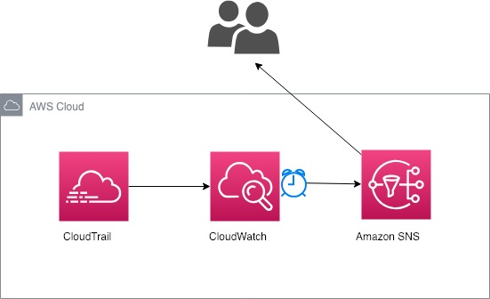
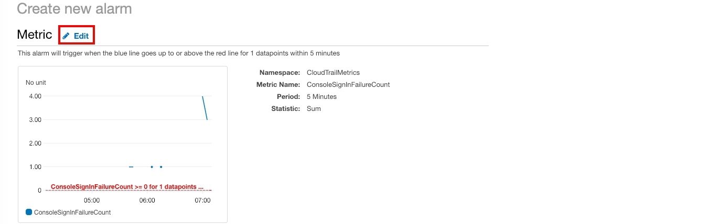
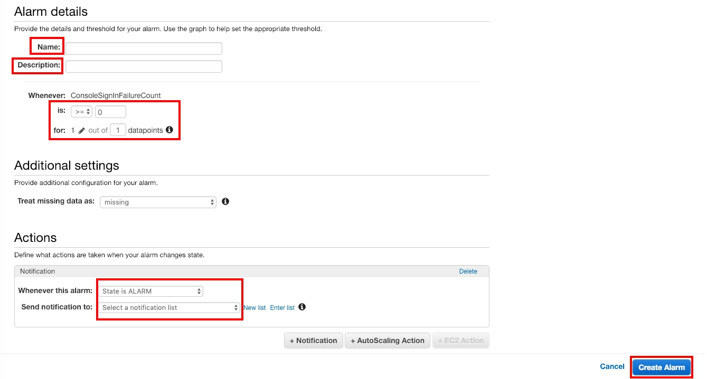
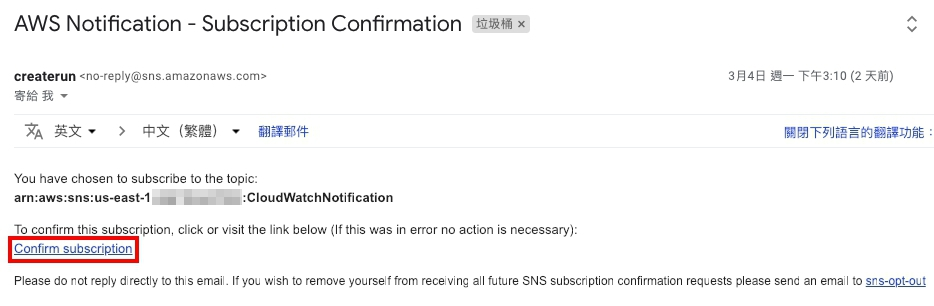
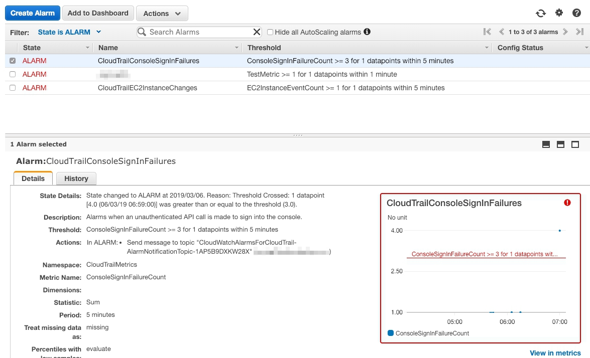
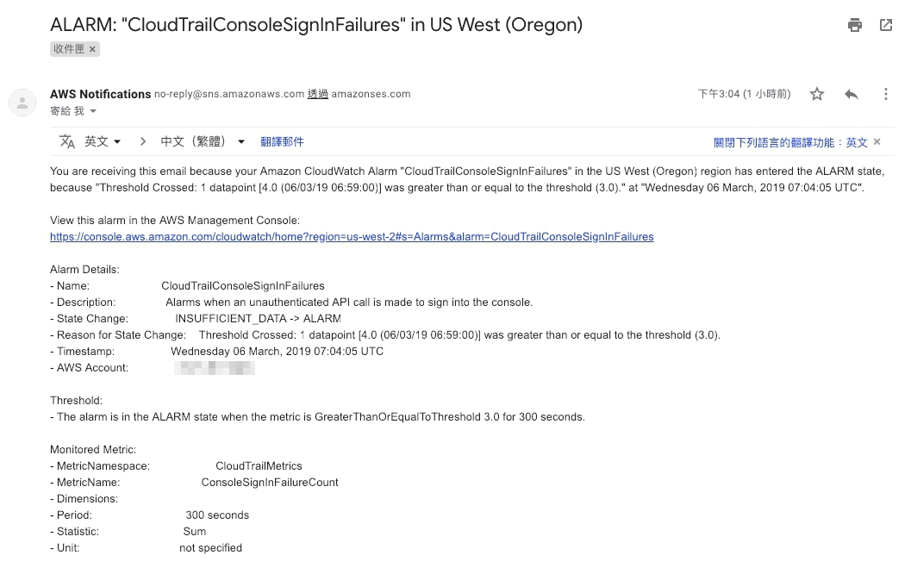

# Create CloudWatch Alarms for CloudTrail Events

## Overview

[AWS CloudWatch](https://aws.amazon.com/tw/cloudwatch/getting-started/) helps you monitors AWS resources and applications run on AWS in real time in your account.

You can create alarms which watch metrics and send notifications or automatically make changes to the resources you are monitoring when a threshold is breached. For example, you can monitor the CPU usage and disk reads and writes of your Amazon EC2 instances and then use this data to determine whether you should launch additional instances to handle increased load. You can also use this data to stop under-used instances to save money.

With CloudWatch, you gain system-wide visibility into resource utilization, application performance, and operational health.

## Scenario

In this lab, you will not only learn how to filter your CloudTrail logs with CloudWatch metric and set an alarm for your account but also notify account users. 

<p align="center">
        
    </p>


## Step by step

### Sending events to CloudWatch logs
You configure your trail to log data events, your trail sends data events to your CloudWatch Logs log group.

1. On the service menu, select **CloudTrail**.

2. On the left panel, click **Trails**. Make sure your trail is logging.

> If you didn't, see the reference [here](https://docs.aws.amazon.com/zh_tw/awscloudtrail/latest/userguide/send-cloudtrail-events-to-cloudwatch-logs.html) and turn **on** logging configuration.

<p align="center"> 

    </p>

### Create CloudWatch metric filter  

1. On the service menu, select **CloudWatch**.

2. On the left panel, click **logs** and choose your log group.

3. Create **Metric filter**.
<p align="center">
    
    </p>

4. In your filter pattern, enter text below and **Assign Metric**.
> You can choose one or create two in this lab. In this lab, author choose Console Sign in Failures.

* Example of Console Sign-In Failures
```
{ ($.eventName = ConsoleLogin) && ($.errorMessage = "Failed authentication") }
```
* Example of Authorization Failures
```
{ ($.errorCode = "*UnauthorizedOperation") || ($.errorCode = "AccessDenied*") }
```
5. Enter the following information and **Create Filter**.

    * Filter name : `CloudWatchAlarmsForCloudTrail-function`
    > we recommend you replace **function** as your function name.
    * Metric Namespace : **CloudTrailMetrics**
    * Metric Name : `Fuction`
    > e.g. ConsoleSignInFailureCount, AuthorizationFailureCount...etc.

### Create an alarm and Use AWS SNS to notify user

With alarm you can easily be notify how your account worked, and alarm can also create an SNS service for you to notify user.

1. **Create Alarm**.

<p align="center">
   
</p>

2. You can see the page like this and click **Edit**.

<p align="center">
    
    </p>

3. (Optional) You can change **static** or **period** and **Select Metric**.

<p align="center">

</p>

4. Enter following information and **Create Alarm**.
    
    * Name : `CloudTrailConsoleSignInFailures`
    * Description : `When an unauthenticated API call is made to sign into the console.`
    > We recommend you enter your funtion name and your own function description.
    * is **>=** `3`
    * 1 out of `1` datapoints

    <p align="center">
    
    </p>

    **Actions**
    * Whenever this alarm : **State is ALARM**
    * Send notification to:	click **New List** and enter `CloudWatchAlarmsForCloudTrail-AlarmNotifyTopic`.
    > We recommend you enter your own name.
    * Email list : enter email which you want to receive notification.

5. You will receive an email and click **Confirm subscription**.

<p align="center">
    
    </p>

## Test

1. Open your AWS Console, log in your account with **Failure**.

2. After fifteen minutes or so, click **Alarm**.
    > You can see state details, Description and so on. On the right side, you can see how CloudWatch count logs.

<p align="center">
    
    </p>

3. You will receive email like this.
    > In this email, you  will see alarm details and Metric details.

<p align="center">
    
    </p>

## Furthermore
For more information about syntax for metric filters and patterns for CloudTrail log events, see the JSON-related sections of [Filter and pattern Syntax](https://docs.aws.amazon.com/AmazonCloudWatch/latest/logs/FilterAndPatternSyntax.html).

 AWS also had provided template for users to use. What's more, you can create your filters and alarms separately or use the AWS CloudFormation template to define them all at once. You can see [reference](https://docs.aws.amazon.com/awscloudtrail/latest/userguide/use-cloudformation-template-to-create-cloudwatch-alarms.html).


## Conclusion
You now learned how to send logs to CloudWatch from CloudTrail. Moreover, you can filter logs by yourself and create alarm to notify your user when their accounts are in trouble or have some change.


## Reference

* [AWS CloudTrail](https://docs.aws.amazon.com/awscloudtrail/latest/userguide/cloudtrail-user-guide.html)
* [AWS CloudWatch](https://docs.aws.amazon.com/AmazonCloudWatch/latest/monitoring/WhatIsCloudWatch.html)