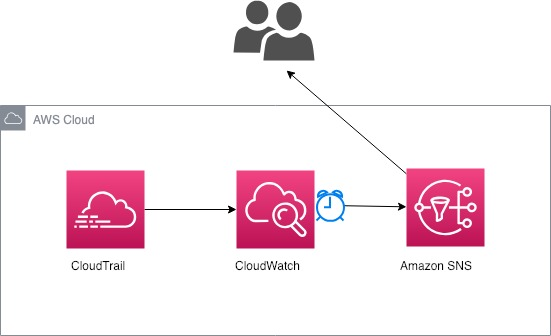
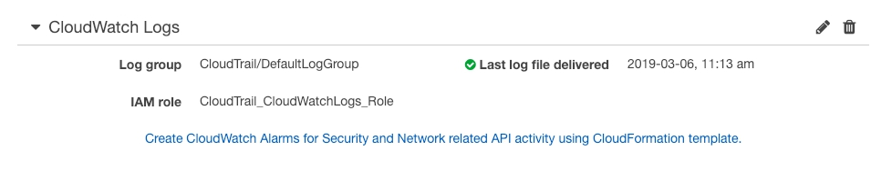
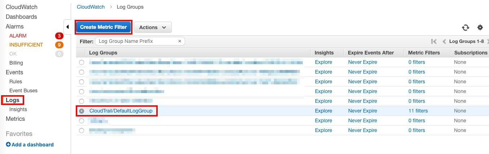
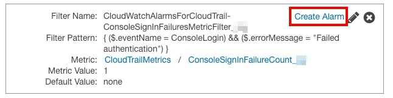
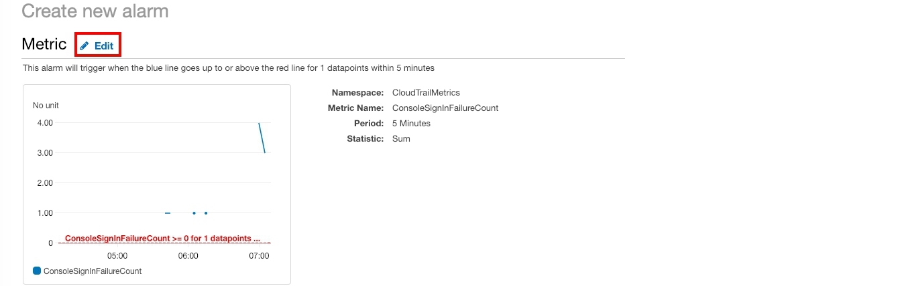
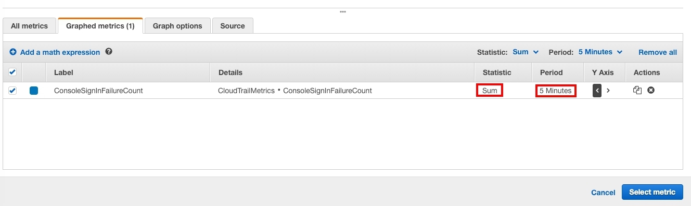
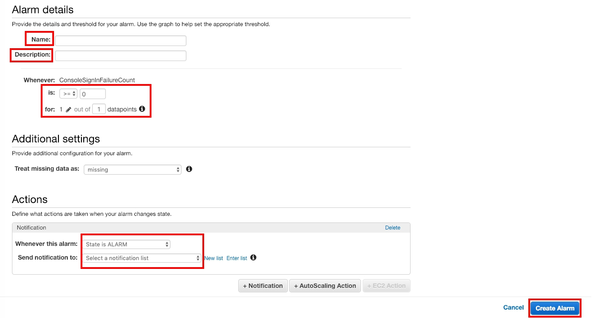
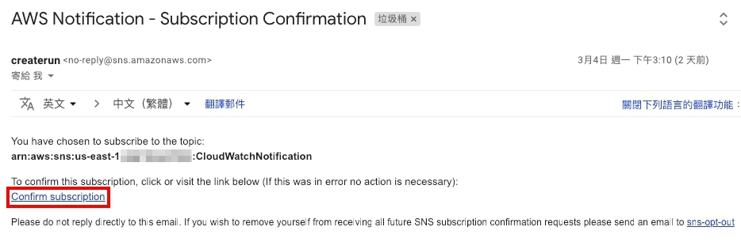
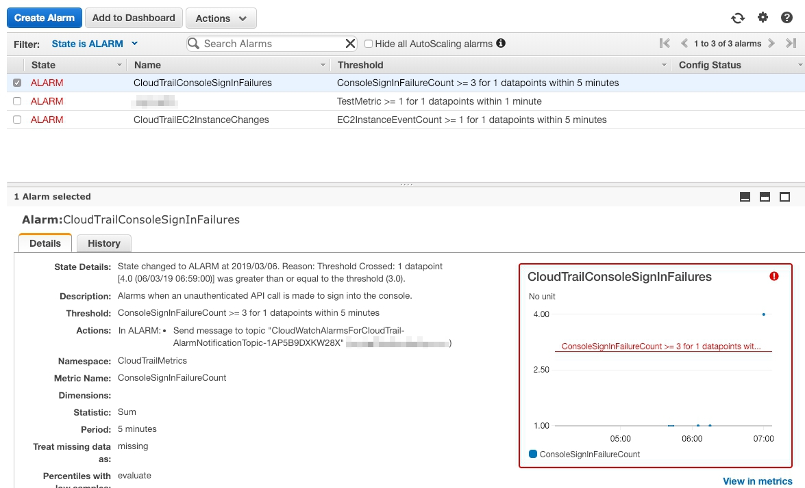
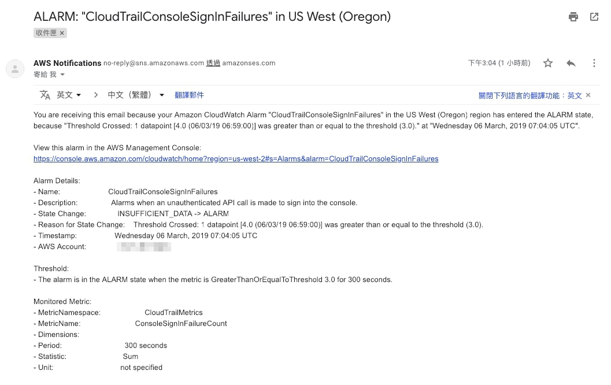

# 運用 CloudTrail 的 Logs 建立 CloudWatch 警示，並送出安全性通知

## 前言
[AWS CloudWatch](https://aws.amazon.com/tw/cloudwatch/getting-started/) 可即時監控帳號使用的 AWS 資源及在 AWS 上執行的應用程式。透過你建立的監控指標，CloudWatch 在超過自訂的值時傳送通知，或自動變更監控的資源。例如：透過監控 EC2 CPU 的用量和 EC2 磁碟的讀取和寫入，以判斷應該啟動額外的 EC2 處理增加的量，也可以透過監控來停止沒有在使用的 EC2 來節省成本。

透過 CloudWatch 以及自訂 Filter 設定，你可以獲得系統資源的使用率、應用程式效能和運作狀態。

## 情境架構
透過這個 lab ，你會學到如何將 CloudWatch 收到的 logs 做篩選並且設定 CloudWatch 的 Alarm 來做警示，並且運用 AWS SNS的功能來通知帳戶使用者。

<p align="center">
        
    </p>


## 建置過程

### 傳送事件到 CloudWatch Logs
> 設定你的 Trail 紀錄事件 log，讓 CloudTrail 把 Logs 傳到 CloudWatch 的 log group。

* 在服務選單，選擇 **CloudTrail**。

* 左邊選單，點選 **Trails**，確認你的 Logs 是有被記錄的。

> 如果沒有的話，可以參考[傳送事件到CloudWatch logs](https://docs.aws.amazon.com/zh_tw/awscloudtrail/latest/userguide/send-cloudtrail-events-to-cloudwatch-logs.html)。
<p align="center">
        
    </p>

### 建立 CloudWatch Ｍetric Alarm

1. 在服務選單，選擇 **CloudWatch**。

    * 左邊選單中，點選 **logs** 並且選擇你的 log groups。

    * 建立 **Metric filter**。

<p align="center">
    
    </p>

2. 在 Filter pattern 中，輸入資訊如下並 **Assign Metric**。

    > 本篇文章以 Console Sign in Failures 為例

* Console Sign-In Failures ：

```
{ ($.eventName = ConsoleLogin) && ($.errorMessage = "Failed authentication") }
```

3. 輸入以下資訊並 **Create Filter**。

    *  **Filter 名稱** : `CloudWatchAlarmsForCloudTrail-function`
    > 推薦使用自己的 function 名稱 取代 **function**。
    * **Metric Namespace** : **CloudTrailMetrics**
    * **Metric 名稱** : `Function`
    > 例如： ConsoleSignInFailureCount, AuthorizationFailureCount...等等。

### 建立一個 Alarm 並使用 AWS SNS 通知使用者

> 將 CloudWatch Alarm 和 SNS 結合，可以透過通知來知道帳號的活動狀況。

1. **Create Alarm**。

<p align="center">
    
    </p>

2. ( 選用 )你可以看到這樣的頁面，點選 **Edit**。

<p align="center">
    
    </p>

3. ( 選用 )你可以改變 **static** 或 **period**，更改後選擇 **Select Metric**。

<p align="center">
    
    </p>

4. 輸入以下的資訊並點選 **Create Alarm**。
    
    * **名字** : `CloudTrailConsoleSignInFailures`
    * **描述** : `When an unauthenticated API call is made to sign into the console.`
    > 輸入自己的 Function 名字，並根據名字作敘述。
    * is **>=** `3`
    * 1 out of `1` datapoints

    <p align="center">
    
    </p>

    **動作**
    * Whenever this alarm 選擇 **State is ALARM**
    * Send notification to 點選 **New List** 並輸入 `CloudWatchAlarmsForCloudTrail-AlarmNotifyTopic`.
    > 輸入自己想要的名稱。
    * Email list 輸入信箱位址。

5. 你會收到訂閱確認信，並點選 **Confirm subscription**.

<p align="center">
    
    </p>

## 測試

1. 打開 AWS Console，使用**失敗**的方式登入你的帳號至少三遍。最少製造出三次登入**失敗**的狀況
    > 這是根據自訂 Filter 的設定。帳號或密碼打錯，log 可以確實被找到，並透過 Alarm 通知使用者。

2. 大約相隔十五分鐘後，登入 AWS 帳戶，進入 AWS CloudWatch主控台，選擇**Alarm**。

    > 點開後透過 Alarm 詳細資訊，包含state details, Description 等等，右邊的圖表可以看到 log 被 CloudWatch fileter 出來的次數。

<p align="center">
    
    </p>

3. 你之前輸入信箱地址會收到來自 AWS SNS 通知信。

    > 在這封信件當中，收到你的 alarm 是來自哪個 metric 和 alarm 的資訊。

<p align="center">
    
    </p>

## 補充
若你對 CloudTrail 日誌事件**指標篩選條件和語法**有興趣，想更加深入了解的詳細資訊，可以參閱 Amazon CloudWatch Logs User Guide 中的[篩選條件和模式語法](https://docs.aws.amazon.com/zh_tw/AmazonCloudWatch/latest/logs/FilterAndPatternSyntax.html)。

AWS 同時也有提供相關的模板給使用者使用。你可以透過 AWS CloudFormation 同時建置很多不同的 Alarm，參考[使用範本建立警示](https://docs.aws.amazon.com/awscloudtrail/latest/userguide/use-cloudformation-template-to-create-cloudwatch-alarms.html)，並根據自己的需求做適當的修改，做出最適合自己的 Alarm。


## 結論

你已經學到如何運用 CloudWatch 去追蹤 CloudTrial logs，並且運用 CloudWatch 的 filter 透過圖表監控篩選所需的資料。並且當你發現帳戶有危險時，可以使用 AWS SNS 使用信件通知使用者。


## 參考網址

* [AWS CloudTrail](https://docs.aws.amazon.com/awscloudtrail/latest/userguide/cloudtrail-user-guide.html)
* [AWS CloudWatch](https://docs.aws.amazon.com/AmazonCloudWatch/latest/monitoring/WhatIsCloudWatch.html)